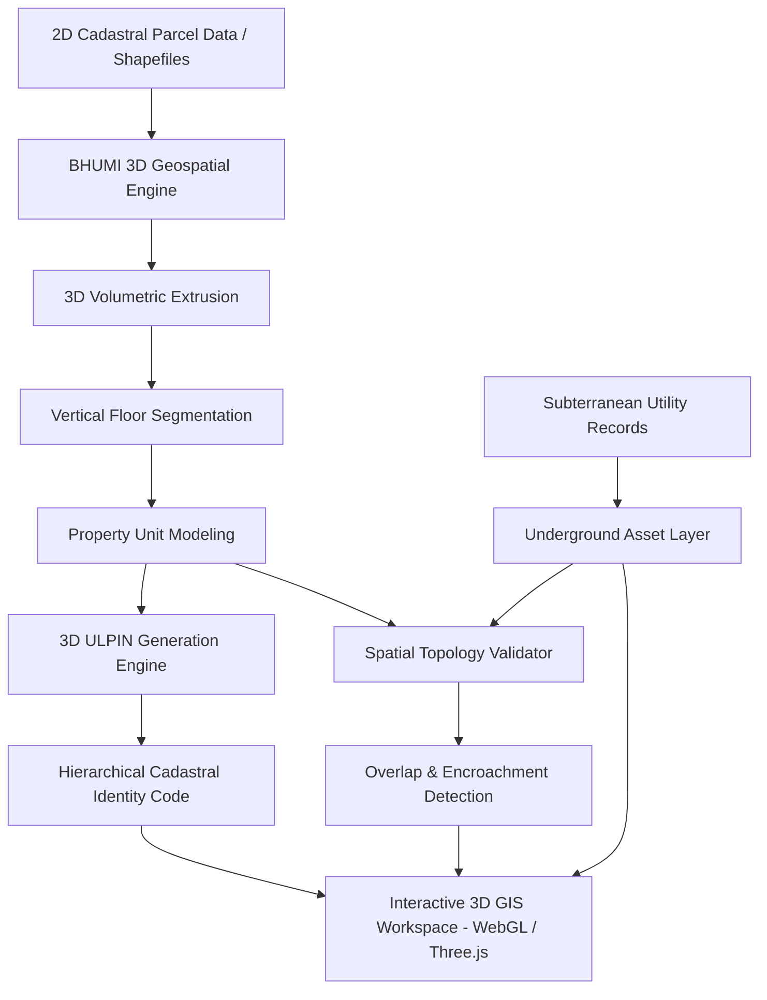

# BHUMI 3D: 3D ULPIN Generation & Vertical Property Mapping System

An AI-assisted geospatial land administration platform designed to transition two-dimensional cadastral records into structured three-dimensional property models with vertical volumetric identity, underground utility mapping, and automated spatial topology validation.

Developed as a functional prototype for the **Smart India Hackathon (SIH)**.

---

## 1. Problem Statement

Conventional cadastral frameworks in India and worldwide define land parcels strictly on a two-dimensional horizontal plane using surface coordinates (latitude and longitude). While the 2D Unique Land Parcel Identification Number (**ULPIN**) effectively indexes ground plots, rapid vertical urbanization creates multi-tiered property rights that existing cadastres cannot formally represent:

1. **Multi-Storey Vertical Ownership:** High-density residential towers and commercial complexes stack dozens of individual ownership units above a single parcel footprint. Standard 2D deeds cannot capture vertical boundaries ($Z$-axis), floor levels, or sub-parcel boundaries.
2. **Subterranean Infrastructure & Easements:** Basements, underground transit conduits, parking levels, and municipal utility corridors (water, electricity, gas, telecom, sewage) coexist below surface level without formalized 3D spatial boundaries, resulting in frequent infrastructure collisions during excavation and construction.
3. **Boundary Disputes & Encroachments:** Without 3D topological verification, cantilever balconies, underground extensions, and structural overlaps remain invisible on 2D land registry maps, creating legal ambiguities and tax assessment challenges.

---

## 2. Proposed Solution

**BHUMI 3D** introduces a 3D cadastral digital twin pipeline that models surface footprints, vertical property units, and subterranean utility assets into an integrated, verifiable volumetric spatial registry:

```
[2D Cadastral Parcel] ➔ [3D Building Extrusion] ➔ [Floor & Unit Segmentation] ➔ [3D ULPIN Assignment] ➔ [Spatial Validation]
```

- **Volumetric Extrusion:** Ingests 2D parcel polygons and architectural parameters to generate georeferenced 3D volumetric building geometries.
- **Vertical Floor & Unit Slicing:** Discretizes multi-storey structures into individual spatial units (apartments, commercial suites, common facilities) with explicit elevation bounds ($Z_{\text{min}}$ to $Z_{\text{max}}$).
- **Proposed 3D ULPIN Extension:** Extends the standard 14-digit ULPIN into a hierarchical vertical property identifier incorporating State Code, District Code, Ground Parcel ID, Vertical Level/Floor, and Unit Hash.
- **Underground Utility Integration:** Visualizes and isolates subterranean utility corridors against parcel easements to ensure conflict-free infrastructure deployment.
- **Topological Conflict Engine:** Automatically validates 3D spatial geometry to detect volume intersections, cantilever encroachments, and boundary buffer violations.

---

## 3. Architecture



---

## 4. Key Functional Modules

- **Interactive 3D GIS Workspace:** Rendered via WebGL using Three.js and React Three Fiber. Features coordinate display, cadastral gridlines, orbit/pan/zoom camera rigs, preset camera angles (Isometric, Top, Side, Street), and dynamic lighting.
- **Exploded Floor & Unit View:** Allows inspectors to expand multi-storey structures along the vertical axis for visual cross-sectional inspection and carpet area verification.
- **3D ULPIN Inspector:** Displays cryptographic and cadastral breakdowns of the 3D property identifier, including geographic hierarchy, vertical bounding coordinates, and verification confidence score.
- **Underground Infrastructure Visualizer:** Toggles subterranean layers with depth-stratified utility conduits, pipeline diameters, and depth clearances below the ground datum.
- **Spatial Validation & Remediation Modal:** Surfaces automated geometric rule checks (Volume Intersection, Cantilever Encroachment, Ground Coverage) with severity ratings and corrective actions.
- **Cadastral Activity & Metric Dashboard:** Real-time analytics summarizing total modelled units, underground assets mapped, geometry confidence scores, and historical spatial audit trails.

---

## 5. Technology Stack

| Layer                       | Technology                                   | Purpose                                                      |
| :-------------------------- | :------------------------------------------- | :----------------------------------------------------------- |
| **Frontend Framework**      | React 19, TypeScript                         | Reactive state and user interface components                 |
| **Routing & Architecture**  | TanStack Start, TanStack Router              | File-based client-side routing and static export             |
| **3D GIS Visualization**    | Three.js, React Three Fiber, Drei            | WebGL volumetric scene, camera controls, mesh rendering      |
| **Styling & Design System** | Tailwind CSS v4, High-density Dark GIS Theme | Hardware-accelerated CSS tokens, scanlines, glassmorphism    |
| **UI Primitives**           | Radix UI primitives, Lucide React icons      | Accessible dialogs, tooltips, popovers, and iconography      |
| **Data Analytics**          | Recharts                                     | Cadastral distribution charts and summary graphs             |
| **Build & Tooling**         | Vite 8, Nitro, ESLint 9, Prettier            | Module bundling, static site generation, and code formatting |
| **Package Manager**         | npm v10+                                     | Deterministic lockfile and dependency management             |
| **CI/CD**                   | GitHub Actions                               | Automated linting, building, and GitHub Pages deployment     |

---

## 6. Project Structure

```
3D-Ulpin-SIH-Prototype/
├── .github/
│   └── workflows/
│       └── ci-cd.yml          # Unified CI/CD workflow (Lint, Build, Deploy)
├── public/                    # Static favicon and metadata assets
├── scripts/
│   └── generate-static.mjs    # Static route prerendering script
├── src/
│   ├── components/
│   │   ├── bhu/               # BHUMI 3D domain workspace, panels, and modals
│   │   ├── gis/               # Three.js 3D scene, ground, and building meshes
│   │   └── ui/                # Reusable Radix UI primitive components
│   ├── data/
│   │   └── demo.ts            # Demonstration cadastral dataset
│   ├── hooks/                 # Responsive and UI utility hooks
│   ├── lib/                   # Spatial utilities, color palettes, and error handlers
│   ├── routes/                # TanStack Start file-based routes
│   │   ├── __root.tsx         # App shell and root HTML metadata
│   │   ├── index.tsx          # Landing page and pipeline overview
│   │   └── app.tsx            # Main 3D GIS interactive workspace
│   ├── state/
│   │   └── bhu.tsx            # React Context for active selection and layer state
│   ├── styles/
│   │   └── globals.css        # Tailwind CSS v4 design tokens and utilities
│   ├── types/
│   │   └── index.ts           # Central TypeScript interfaces and domain models
│   ├── routeTree.gen.ts       # Generated TanStack router route tree
│   ├── router.tsx             # TanStack Router instance
│   ├── server.ts              # Nitro server entrypoint
│   └── start.ts               # Client application entrypoint
├── components.json            # shadcn/ui configuration
├── eslint.config.js           # ESLint flat configuration
├── package.json               # Package configuration and dependencies
├── package-lock.json          # Canonical npm lockfile
├── tsconfig.json              # TypeScript configuration
├── vite.config.ts             # Vite build and plugin configuration
└── LICENSE                    # MIT License
```

---

## 7. Getting Started

### Prerequisites

- **Node.js:** v20.x or later (v22.x recommended)
- **npm:** v10.x or later

### Installation

1. Clone the repository:

   ```bash
   git clone https://github.com/OmkarM9090/3D-Ulpin-SIH-Prototype.git
   cd 3D-Ulpin-SIH-Prototype
   ```

2. Install dependencies:

   ```bash
   npm install
   ```

3. Run the development server:

   ```bash
   npm run dev
   ```

4. Open [http://localhost:3000](http://localhost:3000) (or the port displayed in your terminal).

### Production Build & Static Export

To create an optimized production build and generate static HTML routes:

```bash
npm run build
```

To run static linting and formatting checks:

```bash
npm run lint
npm run format
```

To preview the production bundle locally:

```bash
npm run preview
```

---

## 8. Deployment

The project is configured for automated deployment via GitHub Actions:

- **Workflow:** [`.github/workflows/ci-cd.yml`](.github/workflows/ci-cd.yml)
- **Triggers:** Push to `main` and Pull Requests.
- **Output:** Builds with `GITHUB_PAGES=true` (setting base path to `/3D-Ulpin-SIH-Prototype/`) and deploys to:
  1. GitHub Pages natively via `actions/deploy-pages@v4`.
  2. The orphan `gh-pages` branch via `peaceiris/actions-gh-pages@v4`.

### GitHub Pages Setup

In the repository settings (`Settings` > `Pages` > `Build and deployment`):

- **Source:** Select **GitHub Actions** (recommended) or **Deploy from a branch** (select branch `gh-pages` and folder `/root`).

---

## 9. Data Disclaimer & Limitations

- **Demonstration Dataset:** The property records, dimensions, and parcel geometries in this repository represent a synthetic cadastral model based on urban layouts in Lucknow, Uttar Pradesh (`UP-LKO-P123456`).
- **Proposed Identifier Format:** The 3D ULPIN format implemented is a proposed research extension developed for the Smart India Hackathon and does not constitute an officially adopted standard by the Department of Land Resources (DoLR) or Survey of India (SoI).
- **Prototype Status:** Designed and tested for prototype demonstration purposes. Integration with official State land registry databases (e.g., Bhulekh) requires authorized API gateways.

---

## 10. Suggested GitHub Repository Details

- **Description:** AI-assisted 3D ULPIN generation and vertical property mapping system converting 2D cadastral parcels into volumetric digital twins with spatial validation. Built for Smart India Hackathon.
- **Topics:** `smart-india-hackathon`, `sih`, `ulpin`, `3d-gis`, `threejs`, `react-three-fiber`, `cadastral-mapping`, `land-administration`, `geospatial`, `urban-planning`, `typescript`, `vite`

---

## 11. License

This project is open-source software licensed under the [MIT License](LICENSE).
